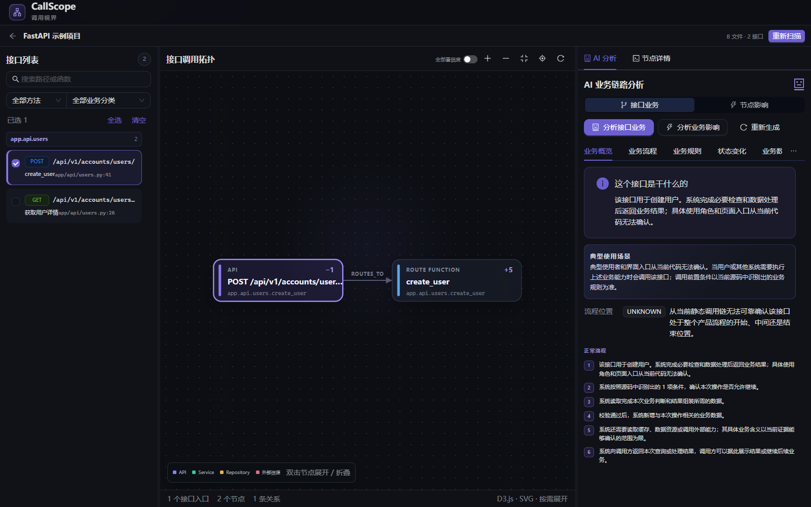
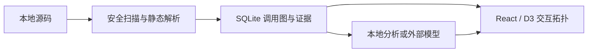

# CallScope（调用视界）

从 HTTP 接口入口查看 FastAPI、Spring Boot 项目的静态调用关系，结合源码证据理解业务流程。



截图来自本地浏览器，使用仓库合成样例和本地证据分析。

## 核心功能

- 导入本地项目并后台扫描，不执行目标代码；删除记录不会删除源码。
- 识别接口、函数与数据库、Redis、外部 HTTP 调用，保留位置、证据和置信度。
- 逐层展开、折叠和合并调用拓扑，查看节点上下游及源码。
- 根据已扫描证据生成单接口、多接口及节点影响分析，支持本地分析和兼容模型服务。
- 缓存分析结果，扫描更新后标记过期，外部模型任务支持状态查询与失败后重试。



技术栈：Python 3.11+、FastAPI、SQLAlchemy、Alembic、Tree-sitter、NetworkX；React 19、TypeScript、Vite、D3、Zustand、Ant Design。

## 本地启动

需要 Python 3.11+、uv、Node.js 22.12+ 和 npm。以下命令从项目根目录执行；Windows 可用 `npm.cmd` 代替 `npm`。

后端终端：

```powershell
cd backend
uv sync --frozen
# 可选：首次配置时复制，已有 .env 请直接编辑，避免覆盖
Copy-Item .env.example .env
uv run alembic upgrade head
uv run uvicorn app.main:app --host 127.0.0.1 --reload
```

前端另开终端，从项目根目录执行：

```powershell
cd frontend
npm ci
npm run dev
```

打开 [本地页面](http://localhost:5173)，[接口文档](http://127.0.0.1:8000/docs)。默认无需模型密钥。
在页面导入 `backend/tests/fixtures/fastapi_sample` 的本机绝对路径可体验合成示例。

## 使用边界与配置

这是单用户本地工具，没有登录和多租户隔离；后端只绑定回环地址，勿直接暴露到公网或局域网。项目 ID 校验用于防止跨项目混用节点，不能替代用户认证。

默认 `CALLSCOPE_AI_PROVIDER=local` 只根据证据生成分析。启用 `openai-compatible` 时，在 `backend/.env` 配置模型名、密钥和服务地址；所选拓扑及启用的源码片段会发送给该服务，应只分析可共享的代码。默认不保存原始 Prompt 和模型原始响应；结构化结果可能包含业务信息，启动时清理超过 `CALLSCOPE_AI_RETENTION_DAYS`（默认 30 天）的分析记录。删除项目会级联移除数据库中的扫描与分析记录。

前端可选配置见 `frontend/.env.example`，只允许公开变量。后端优先使用 `backend/.env`，根目录 `.env` 是兼容回退；系统环境变量优先级最高。SQLite 默认文件位于启动后端时的工作目录，因此请从 `backend` 启动。

静态分析无法完整还原动态分派、反射及运行期条件，AI 结论需要结合源码核实。本项目没有 RAG、MCP、会话记忆或自主工具执行，因此不创建这些空模块。

本次规范整理由项目维护者提出要求，Codex 辅助完成重构、文档和自动化测试；不据此声明此前全部代码的个人独立开发经历。

## 验证和开发

```powershell
# backend 目录
uv run ruff check app tests alembic
uv run ruff format --check app tests alembic
uv run pytest

# frontend 目录
npm run format:check
npm test
npm run build
npm run test:e2e
```

Windows 浏览器测试默认使用已安装的 Edge；CI 安装 Chromium。测试使用合成示例与 Fake 模型，不调用付费模型。

- [架构与规范适配](docs/architecture.md)
- [API 与版本迁移](docs/api.md)
- [数据库与迁移](docs/database.md)
- [本地运行与维护](docs/development.md)
- [规范核对记录](docs/standards-review.md)
- [变更记录](CHANGELOG.md)
