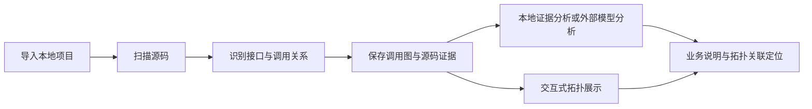

# CallScope（调用视界）

CallScope 是一个面向 FastAPI 和 Spring Boot 项目的接口调用拓扑分析工具，帮助开发者从 HTTP 接口入口理解代码调用关系和业务流程。

阅读后端项目时，一个接口的逻辑往往分散在路由、Service、Repository 和外部服务中，需要反复跳转文件才能串起完整链路。CallScope 通过静态分析将这些关系展示为可交互拓扑，并保留源码位置与调用证据，辅助代码阅读和修改影响排查。

## 技术栈

| 分类 | 技术与用途 |
| --- | --- |
| 后端 | Python、FastAPI、Pydantic；Tree-sitter 解析源码，NetworkX 处理调用图 |
| 前端 | React、TypeScript、Vite、Ant Design；D3 展示拓扑，Zustand 管理状态 |
| 数据库 | SQLite、SQLAlchemy、Alembic，保存扫描结果并管理表结构迁移 |
| AI 分析 | 默认使用本地证据分析，可选接入 OpenAI 兼容模型接口；通过结构化输出校验和引用白名单约束结果 |

## 功能演示


截图由本地浏览器实际渲染，使用仓库内的合成 FastAPI 样例和本地证据分析。

## 核心功能

- **项目扫描与接口识别**：导入本地 FastAPI 或 Spring Boot 项目，识别接口入口及基础调用关系，不执行目标代码。
- **交互式调用拓扑**：逐层展开、折叠调用节点，合并多个接口的拓扑，查看上下游关系。
- **源码与证据定位**：查看函数签名、源码片段、调用位置及置信度，辅助核实分析结果。
- **业务链路分析**：支持单接口、多接口和节点影响分析，将分析条目与拓扑节点关联定位。

## 实现流程



## 快速开始

环境要求：Python 3.11+、uv、Node.js 22.12+ 和 npm。下载或克隆项目后，打开两个终端，均从项目根目录开始执行。

后端终端：

```powershell
cd backend
uv sync --frozen
uv run alembic upgrade head
uv run uvicorn app.main:app --host 127.0.0.1 --reload
```

前端终端（Windows PowerShell）：

```powershell
cd frontend
npm.cmd ci
npm.cmd run dev
```

macOS / Linux 将 `npm.cmd` 换成 `npm`。默认配置使用 SQLite 和本地证据分析，无需模型密钥；请从 `backend` 目录启动后端，确保数据库路径一致。

打开 [项目页面](http://localhost:5173)，在“导入本地项目”中填写目标项目的绝对路径。可先使用仓库中 `backend/tests/fixtures/fastapi_sample` 的本机绝对路径体验，扫描后打开工作台选择接口。

接口文档：[Swagger UI](http://127.0.0.1:8000/docs)。外部模型配置及安装排错见[开发说明](docs/development.md)。

## 参与方式与限制

**参与方式**：项目维护者提出规范整理要求、反馈使用中遇到的问题并确认修改方向；Codex 辅助完成相关重构、问题修复、测试和文档整理。

**使用限制**：

- 当前面向单用户本地使用，没有登录或多租户隔离，不应直接暴露到公网或局域网。
- 静态分析不能完整还原动态分派、反射及运行期条件，分析结论需要结合源码核实。
- 启用外部模型时，所选拓扑及启用的源码片段会发送给对应服务，请只分析允许共享的代码。

## 详细文档

- [架构与模块职责](docs/architecture.md)
- [配置、验证与常见问题](docs/development.md)
- [API 说明](docs/api.md)
- [数据库与迁移](docs/database.md)
