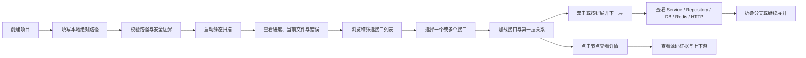
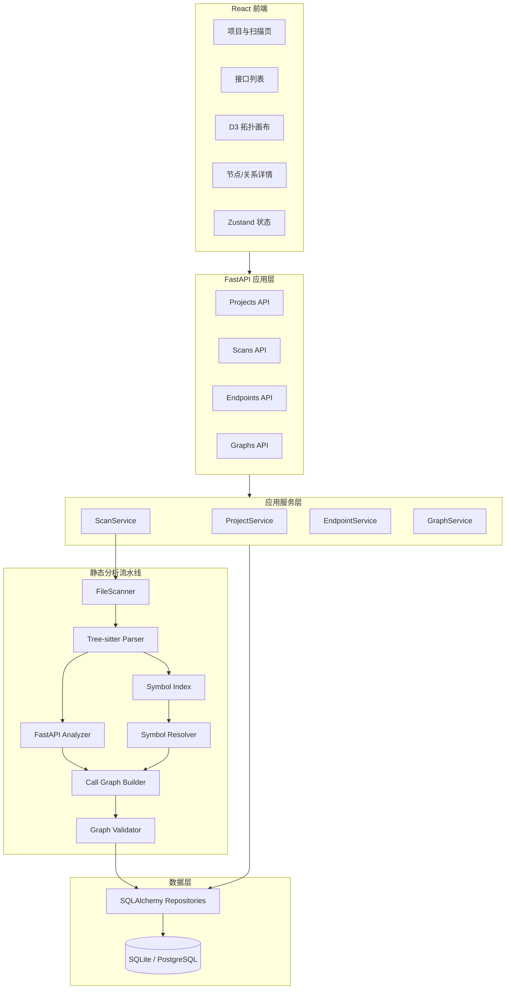
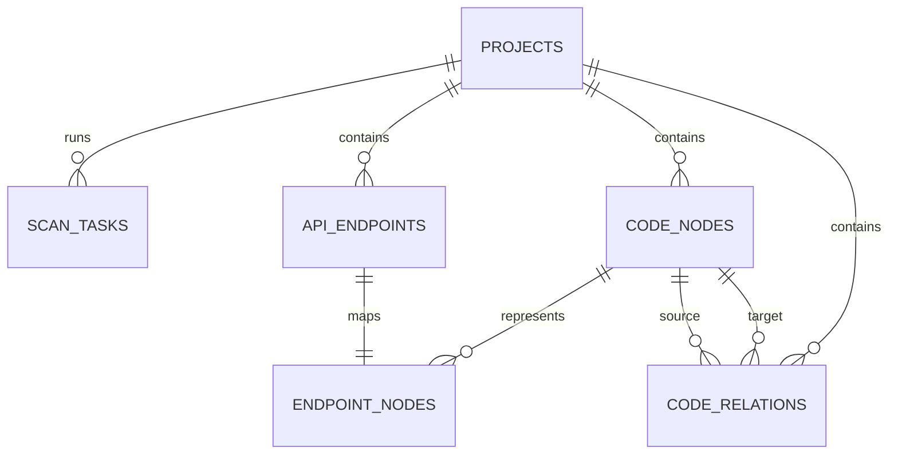
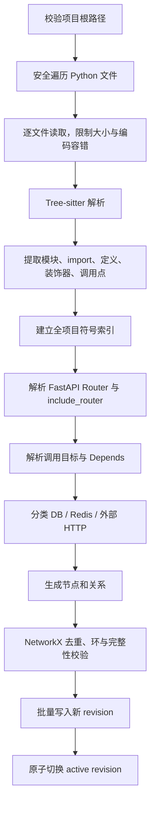

# 接口业务拓扑分析平台：阶段一需求与架构方案

> 文档状态：阶段一基线  
> 当前范围：需求、架构与开发计划，不生成项目代码  
> 技术约束：Python + FastAPI；React + TypeScript + D3.js；Tree-sitter 静态分析  
> 参考产品：Understand Anything Demo

## 0. 结论与关键决策

本项目建议命名为 **CallScope（调用视界）**，定位为“面向陌生 FastAPI 项目的接口调用链静态分析与可视化工具”。

MVP 不追求生成一个覆盖整个代码库的知识图谱，而是回答一个更具体的问题：

> 某个 HTTP 接口从路由入口开始，依次调用了哪些函数、Service、Repository、数据库或外部资源？每一条结论的源码证据在哪里？

核心架构决策如下：

1. **先完整分析，后按需展示**：扫描阶段在后端构建并持久化项目的结构化调用图；前端只按接口和节点逐层取数，避免一次渲染大图。
2. **事实优先，推断分级**：Tree-sitter AST 提取确定性事实；符号解析负责跨文件关联；无法确定的关系必须降级为 `MEDIUM` 或 `LOW`，不得伪装为确定关系。
3. **接口与路由函数分离建模**：HTTP 接口是 `API` 节点，实际 Python 处理函数是 `ROUTE_FUNCTION` 节点，两者用 `ROUTES_TO` 连接。
4. **分析与查询解耦**：扫描服务写入数据库，图查询服务只读持久化结果；展开节点时不重新扫描源码。
5. **源码证据是一等数据**：每条边都保存文件、行号、证据片段和置信度；没有证据的关系不进入默认图。
6. **静态分析绝不执行目标项目**：不 import、不运行脚本、不安装目标依赖、不执行迁移。
7. **借鉴参考 Demo 的交互思想，不复制其产品范围**：保留分层钻取、搜索、过滤、节点详情和图形聚焦；排除 AI 摘要、知识库、语义搜索、引导游览、多语言分析等能力。

---

## 1. 项目名称建议

### 推荐名称

**CallScope（调用视界）**

- `Call`：明确表达调用关系。
- `Scope`：表达查看范围、逐层展开和聚焦。
- 中文名“调用视界”适合内部平台，也方便后续扩展到其他后端框架。

### 备选名称

| 名称 | 含义 | 评价 |
| --- | --- | --- |
| API TraceMap | 接口调用地图 | 直观，但容易与运行时链路追踪混淆 |
| RouteLens | 路由透镜 | 简洁，突出接口入口 |
| CodeFlow Atlas | 代码流程图谱 | 范围偏大，不够聚焦 FastAPI |
| TopoAPI | 接口拓扑 | 中文团队易理解，但品牌辨识度一般 |

后续文档统一使用 **CallScope**。

---

## 2. 产品定位

### 2.1 目标用户

- 刚接手陌生 Python/FastAPI 项目的开发者；
- 需要评估接口改动影响范围的维护人员；
- 需要快速审查 Controller → Service → Repository 调用关系的架构师；
- 需要定位接口源码证据的测试、运维和安全人员。

### 2.2 核心使用场景

1. 用户导入本地 FastAPI 项目。
2. 系统仅通过静态分析识别接口及基础调用关系。
3. 用户从接口列表选择一个或多个入口。
4. 系统展示接口第一层调用关系。
5. 用户按需展开下游节点，直至 Service、Repository、数据库、Redis 或外部 HTTP 调用。
6. 用户点击节点或边，查看其源码位置、证据和置信度。

### 2.3 产品价值

- 将“逐文件搜索调用链”转化为“从接口入口逐层探索”；
- 将推断结果与源码证据绑定，便于人工复核；
- 通过懒加载图数据控制大型项目的前端渲染成本；
- 为后续支持更多框架提供统一的图模型，但 MVP 只实现 FastAPI。

### 2.4 与参考 Demo 的关系

Understand Anything 强调可搜索、可点击、可缩放的交互知识图谱，以及按架构层级理解代码。CallScope 借鉴这些交互原则，但将视角缩小到“HTTP 接口调用拓扑”，并采用确定性静态分析优先的方案。

| 参考 Demo 能力 | CallScope MVP 处理 |
| --- | --- |
| 可平移、缩放、搜索、点击的交互图 | 采用 |
| 分层钻取、类型/架构层着色 | 采用 |
| 右侧节点解释与关系 | 采用，但内容来自静态事实 |
| 全代码库知识图谱 | 不采用，以接口入口子图为主 |
| AI 语义总结、业务域映射 | 不采用 |
| Guided Tour、Persona、语义搜索 | 不采用 |
| 多语言、多知识库 | 不采用 |

---

## 3. MVP 用户流程



### 3.1 主流程

1. 进入项目页，创建项目并填写项目名称、根目录。
2. 后端验证目录存在、是目录、可读，并记录规范化后的绝对路径。
3. 用户启动扫描。
4. 页面轮询扫描状态，显示进度、当前文件、成功/跳过/失败数量。
5. 扫描结束后进入拓扑页。
6. 左栏展示接口列表；支持路径、函数名、HTTP 方法、模块过滤。
7. 选择一个接口时，中栏加载 `API → ROUTE_FUNCTION` 及路由函数第一层下游。
8. 双击节点或点击节点上的展开按钮，请求该节点的直接子节点。
9. 点击节点或边时，右栏显示详细信息和源码证据。
10. 多选接口时，合并子图并标记共享节点。
11. 用户可重新扫描；扫描完成后图查询只读取新一版已提交结果。

### 3.2 异常流程

- 路径不可访问：项目不创建，返回明确校验错误。
- 扫描单个文件失败：记录错误并继续其他文件。
- 扫描整体失败：保留上一次成功快照，不用半成品覆盖。
- 节点无法解析：创建 `UNRESOLVED` 节点并标为低置信度，默认图中隐藏。
- 图为空：展示“未找到满足当前置信度条件的关系”，而非白屏。
- 项目在扫描期间被删除或移动：扫描任务失败并给出具体文件错误。

---

## 4. MVP 功能清单

### 4.1 项目与扫描

- 创建、查询、删除本地项目记录；
- 根路径规范化和安全校验；
- 手动启动扫描和重新扫描；
- 扫描任务状态、百分比、当前文件、错误摘要；
- 忽略无关目录、软链接和超限文件；
- 扫描结果版本化提交，避免读取半成品。

### 4.2 FastAPI 接口识别

- 识别 `FastAPI()`、`APIRouter()`；
- 识别 `get/post/put/delete/patch/options/head` 路由装饰器；
- 识别同一函数上的多个路由装饰器；
- 识别 `include_router()`；
- 合并父级和子级路由 `prefix`；
- 提取路径、方法、函数、文件、行号、参数、返回类型、标签、摘要和 `Depends`；
- 标记无法完全解析的动态路径或动态 prefix。

### 4.3 调用关系

- 提取模块、类、函数、方法和 import；
- 提取直接函数调用、模块函数调用、对象方法调用；
- 基于赋值、构造器、参数类型注解和 `Depends` 解析接收者类型；
- 识别常见 SQLAlchemy、Redis 和 HTTP 客户端调用；
- 保存每条关系的证据和置信度；
- 支持循环调用，不因环而无限展开。

### 4.4 图查询与交互

- 单接口第一层图；
- 多接口合并图；
- 节点直接下游、直接上游查询；
- 节点、边和源码详情；
- D3 SVG 分层布局；
- 缩放、平移、节点拖动、自动适配；
- 节点展开、折叠、重新布局；
- 当前节点及一跳上下游高亮；
- 搜索、类型过滤、置信度过滤；
- 节点和边去重。

### 4.5 右侧详情

- 接口基本信息；
- 函数/类/方法签名；
- 上游与下游节点摘要；
- 文件、起止行号；
- 代码证据；
- 关系类型与置信度；
- 基于图路径生成的结构化“调用步骤”，不进行 AI 补写。

---

## 5. 明确不做的功能

MVP 明确不实现：

- MCP、AI Agent、RAG、向量数据库；
- LLM 自动摘要、问答、规则生成、业务语义推理；
- Java/Spring、Flask、Django、Node.js 等其他框架；
- GitHub/GitLab 拉取与集成；
- 动态链路追踪、OpenTelemetry、分布式追踪；
- 自动执行或修改被扫描项目；
- 自动安装被扫描项目依赖；
- Neo4j 等图数据库；
- 权限、租户、组织和协作系统；
- 云端部署和公网项目上传；
- 实时 WebSocket 推送；
- 增量文件监听和 Git diff 影响分析；
- WebGL/Canvas 大图渲染；
- 复杂业务流程语义生成；
- 自动导出 PNG/SVG/报告；
- 参考 Demo 的 Guided Tour、Persona、Knowledge Base、语义搜索。

这些能力只有在 MVP 验收通过后才能进入后续路线图。

---

## 6. 整体系统架构



### 6.1 分层职责

| 层 | 职责 | 禁止事项 |
| --- | --- | --- |
| API 层 | HTTP 参数、Schema、状态码、异常映射 | 不写扫描逻辑 |
| Service 层 | 用例编排、事务、状态流转 | 不操作 AST 细节 |
| Analyzer 层 | 文件发现、AST 提取、符号解析、建图 | 不依赖 HTTP |
| Repository 层 | ORM 查询与批量写入 | 不返回 ORM 给前端 |
| Query 层 | 子图、上下游、合并图查询 | 不重新解析源码 |
| Frontend API 层 | Axios 请求与 DTO 转换 | 不保存业务状态 |
| Zustand Store | 选择、图状态、加载状态 | 不直接操作 DOM |
| D3 层 | 布局、SVG join、zoom、drag、动画 | 不发 API 请求 |

### 6.2 运行模型

- FastAPI 单进程即可满足 MVP。
- 扫描任务先使用应用内后台线程/任务执行器，数据库记录状态。
- 扫描分析在独立 SQLAlchemy Session 中运行。
- 前端每 800–1500 ms 轮询扫描状态；任务结束后停止轮询。
- 生产化前再评估 Celery/RQ，不在 MVP 引入消息队列。
- 开发环境默认 SQLite；模型与迁移必须兼容 PostgreSQL。

### 6.3 扫描结果的一致性

每次扫描产生一个 `scan_revision`：

1. 新任务进入 `PENDING`；
2. 分析结果写入新 revision；
3. 完整性校验通过后，将项目的 `active_revision_id` 原子切换到新 revision；
4. 失败 revision 标记为 `FAILED` 并保留错误；
5. 图查询只读取 `active_revision_id`。

这可避免重新扫描期间页面读取到半张图。

---

## 7. 后端模块设计

```text
backend/app/
├── api/             # HTTP 路由与依赖注入
├── core/            # 配置、数据库、异常、日志
├── models/          # SQLAlchemy 2 ORM
├── schemas/         # Pydantic 2 请求/响应
├── services/        # 应用用例编排
├── analyzers/       # 静态分析核心
├── graph/           # 图构建、校验、NetworkX 查询
├── repositories/    # 数据访问
└── utils/           # 路径与源码工具
```

### 7.1 `api`

- `projects.py`：项目 CRUD；
- `scans.py`：启动扫描、查询状态；
- `endpoints.py`：接口列表与详情；
- `graphs.py`：接口图、节点展开、上下游、合并图；
- `nodes.py`：节点、源码和关系详情。

API 层只接收/返回 Pydantic Schema，并将领域异常映射为统一错误响应。

### 7.2 `services`

- `ProjectService`：路径规范化、项目生命周期；
- `ScanService`：任务状态机、revision、扫描流水线；
- `EndpointService`：筛选、分页、接口详情；
- `GraphService`：子图装配、去重、置信度过滤；
- `SourceService`：从已保存证据或受限根路径读取源码片段。

### 7.3 `analyzers`

- `FileScanner`：安全遍历、忽略规则、大小/数量限制；
- `TreeSitterParser`：解析 Python CST/AST，统一查询入口；
- `ModuleResolver`：文件路径与 Python 模块名互转；
- `DefinitionExtractor`：函数、类、方法、参数、返回值；
- `ImportExtractor`：import、别名、相对导入；
- `FastAPIAnalyzer`：路由器、装饰器、include_router；
- `DependencyAnalyzer`：`Depends` 解析；
- `CallExtractor`：提取 call site 和接收者表达式；
- `SymbolIndex`：定义、import、变量与类型索引；
- `SymbolResolver`：将调用点解析到真实节点；
- `ResourceClassifier`：识别 DB、Redis、外部 HTTP；
- `RelationExtractor`：生成统一关系；
- `CallGraphBuilder`：NetworkX 建图、去重和环检测。

### 7.4 `graph`

- `identity.py`：稳定节点键和边键；
- `builder.py`：由分析事实构建有向多重图；
- `validator.py`：孤立引用、重复边、非法类型、证据缺失检查；
- `query.py`：一跳上下游、路径、合并图；
- `serializer.py`：ORM/领域对象转换为统一 JSON。

建议使用 `networkx.MultiDiGraph`，因为同一对节点可能同时存在 `CALLS`、`DEPENDS_ON` 等不同关系。

### 7.5 统一异常

至少定义：

- `ProjectNotFound`
- `InvalidProjectPath`
- `PathOutsideProject`
- `ScanAlreadyRunning`
- `ScanNotFound`
- `ScanLimitExceeded`
- `NodeNotFound`
- `RelationNotFound`
- `SourceUnavailable`
- `AnalysisError`

统一错误响应示例：

```json
{
  "error": {
    "code": "INVALID_PROJECT_PATH",
    "message": "项目路径不存在或不可读取",
    "details": {
      "field": "rootPath"
    },
    "requestId": "req_..."
  }
}
```

---

## 8. 前端模块设计

### 8.1 页面

- `ProjectPage`：项目列表、创建、删除、扫描状态；
- `GraphPage`：接口列表、拓扑画布、详情三栏；
- 路由：
  - `/projects`
  - `/projects/:projectId/graph`

### 8.2 三栏布局

```text
┌──────────────────────┬────────────────────────────────────┬────────────────────────┐
│ 接口列表 280–360px   │ D3 拓扑画布 flex: 1               │ 详情 340–420px          │
│ 项目/扫描状态        │ 工具栏、图例、加载与空状态          │ 节点/边/接口详情         │
│ 搜索与筛选           │ SVG 分层调用图                     │ 源码证据                 │
│ 单选/多选接口        │ 缩放、拖动、展开、折叠              │ 上下游                   │
└──────────────────────┴────────────────────────────────────┴────────────────────────┘
```

中栏不得被固定宽度挤压；左右栏支持折叠，最小桌面宽度建议为 1280px。MVP 可不适配手机。

### 8.3 状态划分

`projectStore`

- 当前项目；
- 项目列表；
- 扫描任务；
- 扫描轮询状态。

`endpointStore`

- 接口列表；
- 搜索与筛选条件；
- 选中的 endpoint IDs；
- 当前主接口。

`graphStore`

- `nodesById`、`edgesById`；
- 可见节点 ID 集合；
- 已加载/已展开节点集合；
- 当前节点/边；
- 高亮节点/边集合；
- 布局方向、置信度过滤、显示类型；
- viewport；
- 每个入口对应的可达节点集合，用于多接口共享节点高亮。

### 8.4 React 与 D3 边界

React 管理：

- 业务数据；
- 加载/错误/空状态；
- 选中、展开、折叠；
- 详情面板；
- 工具栏和筛选。

D3 管理：

- 分层布局计算；
- SVG `enter/update/exit`；
- 连线、箭头和标签；
- zoom、pan、drag；
- 图形过渡动画；
- `fitView` 所需的包围盒。

D3 的点击和双击事件只调用 React 传入的回调，不直接修改业务 store。

### 8.5 组件建议

```text
components/
├── layout/
│   └── ThreeColumnLayout.tsx
├── project/
│   ├── ProjectForm.tsx
│   └── ScanStatus.tsx
├── endpoint/
│   ├── EndpointFilter.tsx
│   ├── EndpointList.tsx
│   └── EndpointItem.tsx
├── graph/
│   ├── GraphCanvas.tsx
│   ├── GraphToolbar.tsx
│   ├── GraphLegend.tsx
│   ├── GraphEmptyState.tsx
│   └── GraphLoadingOverlay.tsx
└── detail/
    ├── EndpointDetail.tsx
    ├── NodeDetail.tsx
    ├── RelationDetail.tsx
    └── SourceEvidence.tsx
```

---

## 9. 数据库表设计

### 9.1 通用约定

- 主键：字符串 UUID；
- 时间：带时区 UTC；
- 枚举：应用层 Enum + 数据库字符串；
- JSON：SQLAlchemy `JSON`，PostgreSQL 生产环境可映射为 `JSONB`；
- 路径：存相对 `root_path` 的 POSIX 风格路径，项目表单独存根路径；
- 所有扫描结果表带 `scan_revision_id`；
- 删除项目时级联删除其扫描结果；
- API 不直接暴露 ORM。

### 9.2 核心表

#### `projects`

| 字段 | 类型 | 约束/说明 |
| --- | --- | --- |
| id | UUID string | PK |
| name | varchar(120) | 非空 |
| root_path | text | 非空；规范化绝对路径 |
| language | varchar(32) | 默认 `python` |
| framework | varchar(32) | 默认 `fastapi` |
| scan_status | varchar(24) | NOT_SCANNED/SCANNING/READY/FAILED |
| active_revision_id | UUID string nullable | 当前成功扫描版本 |
| total_files | integer | 默认 0 |
| total_endpoints | integer | 默认 0 |
| created_at | timestamp | 非空 |
| updated_at | timestamp | 非空 |

索引：`name`；`root_path` 唯一索引。

#### `scan_tasks`

| 字段 | 类型 | 约束/说明 |
| --- | --- | --- |
| id | UUID string | PK |
| project_id | UUID string | FK |
| revision_id | UUID string | 本次扫描版本 |
| status | varchar(24) | PENDING/RUNNING/SUCCEEDED/FAILED/CANCELLED |
| stage | varchar(32) | DISCOVERY/PARSE/INDEX/RESOLVE/PERSIST/VALIDATE |
| progress | integer | 0–100 |
| current_file | text nullable | 相对路径 |
| discovered_files | integer | 发现数量 |
| processed_files | integer | 已处理数量 |
| skipped_files | integer | 跳过数量 |
| failed_files | integer | 失败数量 |
| error_message | text nullable | 总体错误 |
| error_summary | JSON | 限量错误列表 |
| started_at | timestamp nullable |  |
| finished_at | timestamp nullable |  |
| created_at | timestamp |  |

约束：同一项目最多一个 `PENDING/RUNNING` 任务，由服务层与数据库锁共同保证。

#### `api_endpoints`

| 字段 | 类型 | 说明 |
| --- | --- | --- |
| id | UUID string | PK |
| project_id | UUID string | FK |
| scan_revision_id | UUID string | 扫描版本 |
| http_method | varchar(12) | 大写 |
| path | text | 最终合并路径 |
| function_name | varchar(255) |  |
| qualified_name | text |  |
| module_name | text |  |
| file_path | text | 相对路径 |
| start_line/end_line | integer |  |
| summary | text nullable | docstring/装饰器事实 |
| tags | JSON array[string] |  |
| parameters | JSON array[Parameter] | 固定 Schema |
| response_type | text nullable | 原始类型文本 |
| dependencies | JSON array[Dependency] | 固定 Schema |
| route_node_id | UUID string | 对应 `ROUTE_FUNCTION` |
| metadata | JSON object | 动态路径等受控扩展 |
| created_at | timestamp |  |

唯一键：`project_id + scan_revision_id + http_method + path + qualified_name`。

#### `code_nodes`

| 字段 | 类型 | 说明 |
| --- | --- | --- |
| id | UUID string | PK |
| project_id | UUID string | FK |
| scan_revision_id | UUID string |  |
| stable_key | text | 跨扫描可重算的稳定键 |
| node_type | varchar(32) | 节点类型 |
| name | varchar(255) | 展示名 |
| qualified_name | text | 全限定名 |
| module_name | text nullable |  |
| file_path | text nullable |  |
| start_line/end_line | integer nullable |  |
| signature | text nullable |  |
| source_excerpt | text nullable | 限长证据片段 |
| metadata | JSON object | 固定扩展键 |
| created_at | timestamp |  |

唯一键：`project_id + scan_revision_id + stable_key`。

`stable_key` 示例：

- `api:GET:/api/users/{user_id}:app.api.users.get_user`
- `function:app.services.user_service.get_user`
- `method:app.repositories.user_repository.UserRepository.find_by_id`
- `table:users`
- `external:https://example.com/users`
- `unresolved:app.api.users:get_user:service.fetch`

#### `code_relations`

| 字段 | 类型 | 说明 |
| --- | --- | --- |
| id | UUID string | PK |
| project_id | UUID string | FK |
| scan_revision_id | UUID string |  |
| stable_key | text | 用于去重 |
| source_node_id | UUID string | FK |
| target_node_id | UUID string | FK |
| relation_type | varchar(32) |  |
| confidence | varchar(16) | CONFIRMED/HIGH/MEDIUM/LOW |
| file_path | text nullable | 调用发生文件 |
| line_number | integer nullable | 调用发生行 |
| column_number | integer nullable |  |
| evidence | text nullable | 限长源码 |
| metadata | JSON object | 解析依据、调用表达式等 |
| created_at | timestamp |  |

唯一键：`project_id + scan_revision_id + stable_key`。

#### `endpoint_nodes`

| 字段 | 类型 | 说明 |
| --- | --- | --- |
| id | UUID string | PK |
| endpoint_id | UUID string | FK |
| node_id | UUID string | API 节点 |

接口必须拥有独立 `API` 节点；该表显式记录业务对象与图节点的对应关系。

### 9.3 JSON 字段结构

`parameters` 每项固定为：

```json
{
  "name": "user_id",
  "location": "PATH",
  "type": "int",
  "required": true,
  "default": null
}
```

`dependencies` 每项固定为：

```json
{
  "parameterName": "service",
  "providerExpression": "get_user_service",
  "resolvedQualifiedName": "app.dependencies.get_user_service",
  "confidence": "CONFIRMED"
}
```

禁止把任意分析器内部对象直接塞入 JSON 字段。

### 9.4 实体关系



---

## 10. Tree-sitter 扫描流程

### 10.1 总体流水线



### 10.2 文件发现

默认忽略：

```text
.git .idea .vscode node_modules venv .venv __pycache__
dist build coverage .pytest_cache .mypy_cache
```

安全规则：

- 仅接受本机已存在的绝对目录；
- 使用 `resolve(strict=True)` 规范化根目录；
- 每个候选文件再次确认规范化路径仍在根目录内；
- 默认不跟随目录软链接；
- 跳过设备文件、管道和 socket；
- 默认单文件最大 2 MiB；
- 默认最多 10,000 个 Python 文件；
- 默认最多遍历 50,000 个目录项；
- 源码证据单片段最大 4 KiB；
- 解析错误只影响单文件；
- 不执行任何文件。

限制值由环境变量配置，不写死在分析器中。

### 10.3 两遍分析

**第一遍：事实收集**

- 文件与模块；
- import/别名/相对导入；
- 函数、类、方法、参数、返回注解；
- 赋值、实例化和类型注解；
- 装饰器和调用表达式；
- `return`；
- 字符串常量及其源码范围。

**第二遍：跨文件解析**

- 构造模块表、定义表、类成员表；
- 解析 import alias；
- 解析变量可能类型；
- 解析 `include_router` prefix 传播；
- 解析调用点目标；
- 生成关系和置信度。

不能在读取第一个文件时立即猜测跨文件调用目标；全局符号索引建立后再解析。

### 10.4 Tree-sitter 查询组织

对以下结构分别维护查询：

- module imports；
- function/class definitions；
- decorators；
- call expressions；
- assignments；
- typed parameters；
- return statements。

查询结果转换为内部不可变 DTO，后续模块不直接长期持有 Tree-sitter Node，避免解析树生命周期和字节偏移问题。

### 10.5 编码与行号

- 先检测 Python coding cookie，再尝试 UTF-8；
- 无法解码时跳过文件并记录；
- Tree-sitter 使用字节偏移，展示层使用 1-based 行号；
- 证据由原始字节范围切片后解码，避免按字符偏移截错；
- 保存开始行、结束行、调用点行和可读证据。

---

## 11. FastAPI 接口识别方案

### 11.1 识别对象

建立三类内部事实：

- `AppBinding`：变量绑定到 `FastAPI()`；
- `RouterBinding`：变量绑定到 `APIRouter(prefix=..., tags=...)`；
- `IncludeRouterCall`：某 app/router 包含另一个 router，并带额外 prefix/tags；
- `RouteDecorator`：`@app.get(...)` 或 `@router.post(...)`。

### 11.2 路由装饰器识别

目标 AST 形态：

```text
decorated_definition
  decorator
    call
      function: attribute
        object: identifier
        attribute: get|post|put|delete|patch|options|head
```

识别规则：

1. 装饰器接收者必须能解析到 `AppBinding` 或 `RouterBinding`；
2. 方法名映射为 HTTP method；
3. 第一个位置参数或 `path=` 必须为可静态求值字符串；
4. `tags`、`response_model`、`summary` 仅解析字面量或可追踪常量；
5. 动态表达式保留原始文本并降低置信度。

### 11.3 `include_router` 与 prefix

将 router 包含关系建为有向图：

```text
app.include_router(api_router, prefix="/api")
api_router.include_router(user_router, prefix="/users")
user_router = APIRouter(prefix="/v1")
```

最终路径：

```text
/api + /users + /v1 + /{user_id}
```

处理要求：

- 规范化 `/`，避免双斜线；
- 保留根路径 `/`；
- 支持跨模块 import 和 alias；
- 一个 router 可被多个父 router 引用，因此同一路由函数可生成多个 endpoint；
- include 图出现环时终止该路径并记录错误；
- 动态 prefix 无法求值时保留占位表达式，置信度降级。

### 11.4 参数分类

优先规则：

1. 名称出现在路径模板中 → `PATH`；
2. `Depends(...)` → `DEPENDENCY`；
3. `Body/Form/File/Header/Cookie/Query/Path` 显式声明 → 对应位置；
4. Pydantic `BaseModel` 子类参数 → `BODY`；
5. 其他标量类型 → `QUERY`；
6. 无法判断 → `UNKNOWN`。

### 11.5 Pydantic 模型

识别继承自 `BaseModel` 或可解析别名的类：

- 记录模型节点；
- 路由参数使用该类型时生成 `VALIDATES` 或 `DEPENDS_ON` 关系；
- `response_model` 或返回注解指向模型时生成 `RETURNS`；
- MVP 不做完整 Pydantic 校验语义复刻。

### 11.6 接口节点

每个识别出的接口生成：

```text
API: GET /api/users/{user_id}
    └─ ROUTES_TO → ROUTE_FUNCTION: app.api.users.get_user
```

这样可以清楚区分 HTTP 元数据与 Python 函数本体，并支持一个函数挂多个路由。

---

## 12. 函数调用关系分析方案

### 12.1 内部调用事实

每个调用点先记录：

- 所在调用者节点；
- 原始表达式，如 `service.get_user(user_id)`；
- callee 形态：identifier/attribute/chained call；
- 接收者表达式；
- 参数文本；
- 文件和源码范围；
- 当前作用域；
- 初步资源分类。

### 12.2 符号索引

至少维护：

- `module_name -> file`；
- `qualified_name -> definition`；
- `module -> imported symbol/alias`；
- `class -> methods`；
- `scope -> local variable bindings`；
- `variable -> candidate types`；
- `function parameter -> annotation`；
- `dependency parameter -> provider/return type`。

### 12.3 解析优先级

从高到低：

1. 同作用域局部函数或本类方法；
2. 明确 `from x import y as z`；
3. 模块别名 `import x as y; y.fn()`；
4. 构造赋值 `service = UserService()`；
5. 类型注解 `service: UserService`；
6. `Depends(get_service)` 的 provider 返回注解/返回构造；
7. `self.service = UserService()` 或构造器参数赋值；
8. 当前模块或唯一全局名称匹配；
9. 同名候选的模块上下文评分；
10. 无法解析则指向 `UNRESOLVED`。

### 12.4 置信度

| 等级 | 条件 | 默认显示 |
| --- | --- | --- |
| CONFIRMED | AST + 唯一符号绑定直接确认 | 是 |
| HIGH | import、类型、赋值和上下文共同指向唯一目标 | 是 |
| MEDIUM | 名称与模块上下文推断，存在少量歧义 | 否 |
| LOW | 无法确认目标，只记录原始调用 | 否 |

置信度由明确规则计算，不使用“看起来像”。

### 12.5 关系类型

MVP 保留有限且可解释的关系：

- `ROUTES_TO`
- `CALLS`
- `DEPENDS_ON`
- `READS`
- `WRITES`
- `QUERIES`
- `RETURNS`
- `VALIDATES`
- `REQUESTS_EXTERNAL_API`
- `USES_REDIS`
- `IMPORTS`
- `CONTAINS`

不要把所有 Python 语法都建图；只有支持接口调用理解的事实进入持久化图。

### 12.6 Service 与 Repository 分类

节点本体仍是函数/方法，`node_type` 可按以下证据分类：

- 类名/模块路径包含 `service` → `SERVICE`；
- 类名/模块路径包含 `repository/repo/dao` → `REPOSITORY`；
- SQLAlchemy 操作 → `DATABASE_OPERATION`；
- Redis 客户端操作 → `REDIS`；
- HTTP 客户端调用 → `EXTERNAL_HTTP`；
- 无匹配 → `FUNCTION`/`METHOD`。

这是展示分类，不改变解析出的真实 qualified name；基于命名的分类证据应写入 metadata。

### 12.7 数据库调用

MVP 识别常见调用形态：

- `session.execute/select/scalars/scalar/get/add/add_all/delete/commit/flush`；
- `query.filter/filter_by/first/all/one/count/update/delete`；
- `select(Model)`、`insert(Model)`、`update(Model)`、`delete(Model)`。

可解析模型或 `__tablename__` 时连接到 `DATABASE_TABLE`；无法解析时连接到 `DATABASE_OPERATION`，不猜表名。

### 12.8 Redis 与外部 HTTP

Redis：

- 常见方法 `get/set/delete/hget/hset/lpush/rpush/publish`；
- 必须先有可解析的 Redis 客户端绑定，或降低置信度。

外部 HTTP：

- `requests.get/post/...`；
- `httpx.get/post/...`；
- `client.get/post/...` 且 client 类型可解析为 `httpx.Client/AsyncClient`；
- URL 为静态字符串时生成外部端点；动态 URL 保存表达式。

### 12.9 循环与递归

- 图允许环；
- 节点展开 API 只返回一跳，因此不会递归查询；
- 前端合并时发现已存在节点，仅新增边；
- 展开状态按 node ID 记录；
- `fitView` 和布局不得依赖无环假设；
- 分层布局对强连通分量先压缩，再对 DAG 分层，最后在分量内偏移排列。

---

## 13. 拓扑按层展开方案

### 13.1 初始图

选择一个接口时返回：

- API 节点；
- 对应 ROUTE_FUNCTION；
- 路由函数的一跳下游；
- 连接这些节点的边。

即初始体验不是只有两个点，也不会一次返回整个调用闭包。

### 13.2 节点展开

`GET /nodes/{node_id}/children` 只返回：

- 该节点当前过滤条件下的直接下游节点；
- 源节点到这些下游节点的边；
- 每个子节点的 `hasChildren` 与 `childCount`；
- 不返回整个已有图。

前端执行：

1. 以 ID 合并节点；
2. 以 stable edge key 合并边；
3. 标记源节点 `loaded=true`、`expanded=true`；
4. 将新增节点加入可见集合；
5. 重新布局；
6. 平滑显示新增节点。

### 13.3 折叠

折叠只改变前端可见性，不删除 store 中的数据：

1. 从目标节点向下遍历已加载边；
2. 某后代若仍被其他可见父节点或其他入口引用，则保持可见；
3. 仅隐藏失去所有可见入口路径的后代；
4. 保留节点坐标、数据和加载状态；
5. 再次展开无需请求，除非 scan revision 已变化。

### 13.4 多接口合并

后端 `graph/combined`：

- 接收 endpoint ID 列表；
- 每个接口取初始子图；
- 按 node ID 去重；
- 按关系 stable key 去重；
- 计算每个节点可由哪些入口到达；
- `entryEndpointIds.length > 1` 的节点标记 `shared=true`。

前端单独移除一个接口时，根据入口可达集合重新计算可见节点，不清空其他接口的图。

### 13.5 上下游高亮

点击节点：

- 当前节点使用主强调色；
- 一跳上游使用蓝色；
- 一跳下游使用绿色；
- 相关边加粗；
- 无关节点透明度降至 0.2–0.35；
- 再次点击空白处恢复。

上下游查询默认一跳；完整路径分析不属于 MVP。

### 13.6 缓存失效

前端图状态绑定 `scanRevisionId`。当重新扫描成功且 revision 变化：

- 清除该项目的 graph store；
- 保留筛选条件；
- 重新拉取接口列表；
- 原 endpoint/node ID 不保证跨 revision 相同；
- 不复用旧图的展开缓存。

---

## 14. D3.js 图形实现方案

### 14.1 渲染技术

- SVG 作为 MVP 渲染载体；
- `d3-selection` 完成数据绑定；
- `d3-zoom` 完成缩放和平移；
- `d3-drag` 完成节点拖动；
- `d3-transition` 完成 enter/update/exit；
- `d3-hierarchy` 不适合多父节点调用图，不作为主数据结构；
- 布局可使用自研分层算法；如后续引入 `d3-dag`，需单独评估，不改变 D3 主导约束。

### 14.2 SVG 结构

```text
svg
├── defs
│   ├── marker-arrow-normal
│   ├── marker-arrow-highlight
│   └── filters
└── viewport-group
    ├── edges-group
    ├── edge-labels-group
    ├── nodes-group
    └── overlays-group
```

zoom transform 只作用于 `viewport-group`。

### 14.3 分层布局

默认从左到右：

- rank 0：API；
- rank 1：ROUTE_FUNCTION；
- rank N：按最短调用深度；
- 同 rank 节点按所属入口、模块、类型排序；
- 共享节点放在相关入口的垂直中间位置；
- 环中的节点放入同一 rank 并轻微错位；
- 节点间距由实际文字尺寸和端口间距决定。

连线使用三次贝塞尔曲线：

```text
M sourceRight
C midX sourceY, midX targetY, targetLeft
```

### 14.4 节点视觉

统一卡片式节点：

- 顶部类型色条；
- 类型图标；
- 主名称；
- 模块/路径副标题；
- 展开/折叠按钮；
- 子节点计数；
- 低置信度虚线边框；
- 共享节点双层描边。

推荐类型色：

| 类型 | 颜色 |
| --- | --- |
| API | 紫色 |
| ROUTE_FUNCTION | 蓝色 |
| FUNCTION/METHOD | 青色 |
| SERVICE | 靛蓝 |
| REPOSITORY | 橙色 |
| DATABASE_OPERATION/TABLE | 绿色 |
| PYDANTIC_MODEL | 粉色 |
| DEPENDENCY | 黄色 |
| REDIS | 红橙色 |
| EXTERNAL_HTTP | 天蓝色 |
| UNRESOLVED | 灰色 |

颜色之外必须同时使用标签/图标，避免仅靠颜色区分。

### 14.5 文本与尺寸

- 节点宽度按类型固定在 190–240px；
- 主标题最多两行；
- 超长文本使用省略号，完整内容放 tooltip；
- 路径优先保留结尾文件名；
- D3 布局前通过 Canvas `measureText` 或固定字符估算计算高度；
- 同一节点更新时复用 DOM，不整体重建 SVG。

### 14.6 交互

- 滚轮缩放，范围建议 `0.2–2.5`；
- 拖动画布平移；
- 拖动节点只更新该节点位置与相邻边；
- 单击选中；
- 双击展开；
- 展开按钮可替代双击，保证可发现性；
- 工具栏提供适配画布、居中选中、重新布局、方向切换；
- Escape 清除选中；
- 防止单击和双击同时触发两次业务动作。

### 14.7 动画

- 新节点从父节点坐标出现，再移动到布局坐标；
- 新边从短线延展到目标；
- 折叠节点向父节点回收并淡出；
- 常规时长 220–320 ms；
- 尊重 `prefers-reduced-motion`；
- 大于约 300 个可见节点时自动关闭复杂过渡。

### 14.8 性能边界

MVP 目标：

- 100 个可见节点流畅交互；
- 300 个可见节点可用；
- 超过 300 个时提示继续过滤或折叠；
- API 每次展开只返回一跳；
- React store 使用 Map/Record 归一化；
- 只更新变化的 SVG 元素；
- drag 期间不触发全图 React render；
- 布局计算与渲染分离，后续可迁移 Web Worker。

---

## 15. 后端 API 设计

### 15.1 通用约定

- 前缀：`/api`；
- JSON 字段对外使用 camelCase；
- Pydantic 内部可用 snake_case + alias；
- 列表使用分页响应；
- 错误使用统一结构；
- 所有图响应包含 `scanRevisionId`；
- 删除项目是显式操作，成功返回 204；
- 扫描启动返回 202。

### 15.2 项目管理

#### `POST /api/projects`

请求：

```json
{
  "name": "用户中心",
  "rootPath": "D:/work/user-service"
}
```

响应：201，项目详情。  
错误：400 路径非法；409 路径已登记。

#### `GET /api/projects`

支持 `page/pageSize/search`，返回项目摘要和扫描状态。

#### `GET /api/projects/{project_id}`

返回项目详情和当前 active revision。

#### `DELETE /api/projects/{project_id}`

只删除 CallScope 数据，不删除磁盘上的目标项目。

### 15.3 扫描

#### `POST /api/projects/{project_id}/scan`

响应：202。

```json
{
  "taskId": "scan_...",
  "status": "PENDING",
  "progress": 0
}
```

项目已有任务运行时返回 409。

#### `GET /api/projects/{project_id}/scan-status`

```json
{
  "taskId": "scan_...",
  "status": "RUNNING",
  "stage": "PARSE",
  "progress": 42,
  "currentFile": "app/services/user_service.py",
  "discoveredFiles": 120,
  "processedFiles": 50,
  "skippedFiles": 3,
  "failedFiles": 1,
  "errors": []
}
```

### 15.4 接口列表

#### `GET /api/projects/{project_id}/endpoints`

查询参数：

- `search`
- `httpMethod`
- `module`
- `tag`
- `page`
- `pageSize`

#### `GET /api/projects/{project_id}/endpoints/{endpoint_id}`

返回接口元数据、参数、依赖和对应 route node。

### 15.5 图查询

#### `GET /api/projects/{project_id}/endpoints/{endpoint_id}/graph`

查询参数：

- `confidence=CONFIRMED,HIGH`
- `includeFirstLevel=true`

#### `GET /api/projects/{project_id}/nodes/{node_id}/children`

查询参数：

- `confidence`
- `relationTypes`
- `nodeTypes`

#### `GET /api/projects/{project_id}/nodes/{node_id}/upstream`

默认一跳；MVP 不开放无限深度。

#### `GET /api/projects/{project_id}/nodes/{node_id}/downstream`

默认一跳，与 `children` 的区别是它返回完整关系摘要，供详情面板使用。

#### `POST /api/projects/{project_id}/graph/combined`

请求：

```json
{
  "endpointIds": ["endpoint-1", "endpoint-2"],
  "confidence": ["CONFIRMED", "HIGH"],
  "includeFirstLevel": true
}
```

限制 endpoint IDs 数量，MVP 默认最多 20 个。

### 15.6 节点与证据

#### `GET /api/projects/{project_id}/nodes/{node_id}`

返回节点详情及一跳上下游摘要。

#### `GET /api/projects/{project_id}/nodes/{node_id}/source`

返回已保存或安全重读的源码片段；必须验证文件仍在项目根目录内。

#### `GET /api/projects/{project_id}/relations/{relation_id}`

返回关系类型、置信度、解析依据、证据和两端节点。

### 15.7 接口步骤

接口详情可返回 `callSteps`，但只能由图的确定性路径生成：

```json
[
  {
    "index": 1,
    "nodeId": "node-route",
    "text": "进入路由函数 get_user",
    "evidenceRelationId": "edge-route"
  },
  {
    "index": 2,
    "nodeId": "node-service",
    "text": "调用 UserService.get_user",
    "evidenceRelationId": "edge-call"
  }
]
```

若有分支，按路径分组展示，不伪造唯一执行顺序。

---

## 16. 图数据 JSON 结构

### 16.1 统一响应

```json
{
  "projectId": "project-1",
  "scanRevisionId": "revision-12",
  "roots": ["node-api-1"],
  "nodes": [
    {
      "id": "node-api-1",
      "stableKey": "api:GET:/api/users/{user_id}:app.api.users.get_user",
      "type": "API",
      "name": "GET /api/users/{user_id}",
      "qualifiedName": "app.api.users.get_user",
      "moduleName": "app.api.users",
      "filePath": "app/api/users.py",
      "startLine": 20,
      "endLine": 28,
      "signature": null,
      "loaded": true,
      "expanded": true,
      "hasChildren": true,
      "childCount": 1,
      "depth": 0,
      "entryEndpointIds": ["endpoint-1"],
      "shared": false,
      "metadata": {
        "httpMethod": "GET",
        "path": "/api/users/{user_id}",
        "tags": ["users"]
      }
    }
  ],
  "edges": [
    {
      "id": "edge-1",
      "stableKey": "node-api-1:ROUTES_TO:node-route-1:20",
      "source": "node-api-1",
      "target": "node-route-1",
      "relationType": "ROUTES_TO",
      "confidence": "CONFIRMED",
      "filePath": "app/api/users.py",
      "lineNumber": 20,
      "columnNumber": 1,
      "evidence": "@router.get('/users/{user_id}')",
      "entryEndpointIds": ["endpoint-1"],
      "metadata": {
        "resolver": "fastapi_decorator"
      }
    }
  ],
  "meta": {
    "nodeCount": 2,
    "edgeCount": 1,
    "truncated": false,
    "confidence": ["CONFIRMED", "HIGH"]
  }
}
```

### 16.2 `loaded` 与 `expanded`

这两个字段是查询时的建议初值，不是数据库事实：

- `loaded`：当前响应已包含其直接子节点；
- `expanded`：当前响应期望前端初始显示其子节点；
- 后续交互状态以前端 store 为准；
- 数据库只保存 `childCount/hasChildren` 的可查询事实，不保存某个用户的展开状态。

### 16.3 节点去重

后端按 `id` 和 `stableKey` 双重校验：

- 同 revision 内 ID 是主依据；
- stableKey 用于发现分析器重复产物；
- 多入口合并后为节点附加 `entryEndpointIds`；
- 相同节点不可因为不同入口而复制。

### 16.4 边去重

边稳定键应包含：

```text
source + relationType + target + filePath + lineNumber + normalizedEvidence
```

同一函数内两个不同调用点可以保留两条边；UI 可选择聚合显示并在详情中列出多条证据。

---

## 17. 项目目录结构

```text
callscope/
├── backend/
│   ├── app/
│   │   ├── main.py
│   │   ├── api/
│   │   │   ├── router.py
│   │   │   ├── projects.py
│   │   │   ├── scans.py
│   │   │   ├── endpoints.py
│   │   │   ├── graphs.py
│   │   │   └── nodes.py
│   │   ├── core/
│   │   │   ├── config.py
│   │   │   ├── database.py
│   │   │   ├── exceptions.py
│   │   │   └── logging.py
│   │   ├── models/
│   │   │   ├── project.py
│   │   │   ├── scan_task.py
│   │   │   ├── api_endpoint.py
│   │   │   ├── code_node.py
│   │   │   └── code_relation.py
│   │   ├── schemas/
│   │   │   ├── common.py
│   │   │   ├── project.py
│   │   │   ├── scan.py
│   │   │   ├── endpoint.py
│   │   │   └── graph.py
│   │   ├── services/
│   │   │   ├── project_service.py
│   │   │   ├── scan_service.py
│   │   │   ├── endpoint_service.py
│   │   │   ├── graph_service.py
│   │   │   └── source_service.py
│   │   ├── analyzers/
│   │   │   ├── file_scanner.py
│   │   │   ├── tree_sitter_parser.py
│   │   │   ├── module_resolver.py
│   │   │   ├── definition_extractor.py
│   │   │   ├── import_extractor.py
│   │   │   ├── fastapi_analyzer.py
│   │   │   ├── dependency_analyzer.py
│   │   │   ├── call_extractor.py
│   │   │   ├── symbol_index.py
│   │   │   ├── symbol_resolver.py
│   │   │   └── resource_classifier.py
│   │   ├── graph/
│   │   │   ├── identity.py
│   │   │   ├── builder.py
│   │   │   ├── validator.py
│   │   │   ├── query.py
│   │   │   └── serializer.py
│   │   ├── repositories/
│   │   │   ├── project_repository.py
│   │   │   ├── scan_repository.py
│   │   │   ├── endpoint_repository.py
│   │   │   └── graph_repository.py
│   │   └── utils/
│   │       ├── path_utils.py
│   │       └── source_utils.py
│   ├── tests/
│   │   ├── fixtures/
│   │   ├── unit/
│   │   └── integration/
│   ├── alembic/
│   ├── alembic.ini
│   ├── pyproject.toml
│   └── README.md
├── frontend/
│   ├── src/
│   │   ├── api/
│   │   │   ├── client.ts
│   │   │   ├── projectApi.ts
│   │   │   ├── endpointApi.ts
│   │   │   └── graphApi.ts
│   │   ├── components/
│   │   │   ├── layout/
│   │   │   ├── project/
│   │   │   ├── endpoint/
│   │   │   ├── graph/
│   │   │   └── detail/
│   │   ├── hooks/
│   │   │   ├── useScanPolling.ts
│   │   │   ├── useGraph.ts
│   │   │   ├── useGraphExpansion.ts
│   │   │   └── useEndpointSelection.ts
│   │   ├── pages/
│   │   │   ├── ProjectPage.tsx
│   │   │   └── GraphPage.tsx
│   │   ├── stores/
│   │   │   ├── projectStore.ts
│   │   │   ├── endpointStore.ts
│   │   │   └── graphStore.ts
│   │   ├── types/
│   │   │   ├── common.ts
│   │   │   ├── project.ts
│   │   │   ├── endpoint.ts
│   │   │   └── graph.ts
│   │   ├── graph/
│   │   │   ├── layout.ts
│   │   │   ├── transform.ts
│   │   │   ├── renderer.ts
│   │   │   ├── interactions.ts
│   │   │   └── styles.ts
│   │   ├── router.tsx
│   │   ├── App.tsx
│   │   └── main.tsx
│   ├── package.json
│   └── README.md
├── examples/
│   └── fastapi-sample/
├── docs/
│   └── 阶段一-需求与架构方案.md
├── .env.example
├── .gitignore
└── README.md
```

目录不为“未来可能的需求”预建大量空模块；上面是目标结构，按开发阶段逐步创建。

---

## 18. 分阶段开发计划

### 阶段二：项目骨架

目标：

- FastAPI、SQLAlchemy 2、Alembic、SQLite；
- React、Vite、TypeScript、Router、Zustand、Axios、Ant Design；
- 基础三栏页面；
- 健康检查和统一错误；
- 前后端开发启动命令。

验收：空数据状态下前后端可启动、API 文档可访问、数据库迁移可执行。

### 阶段三：项目导入与文件扫描

目标：

- 项目 CRUD；
- 路径安全校验；
- 文件发现与忽略规则；
- 扫描任务状态机和轮询 UI；
- 单文件失败隔离。

验收：可导入真实目录并准确统计安全范围内的 `.py` 文件。

### 阶段四：FastAPI 接口识别

目标：

- Tree-sitter Python；
- app/router/装饰器/include_router；
- prefix、tags、参数、返回类型、Depends；
- 接口持久化和左侧列表。

验收：示例项目的路由方法与完整路径准确率达到约定用例的 100%。

### 阶段五：函数与方法节点

目标：

- 函数、类、方法、import、调用点提取；
- CodeNode/CodeRelation；
- 源码证据持久化；
- 路由到处理函数的 `ROUTES_TO`。

验收：同文件和明确 import 的直接函数调用可正确建图。

### 阶段六：基础符号解析

目标：

- import alias；
- 模块路径；
- 实例化和类型注解；
- Depends provider；
- Service/Repository；
- 未解析调用与置信度。

验收：附件中列出的三类 `UserService` 调用写法均有测试并得到正确置信度。

### 阶段七：基础 D3 拓扑

目标：

- 初始接口图；
- 节点、边、箭头、标签；
- zoom/pan/drag；
- 节点选择与右栏详情；
- 自动适配。

验收：30–100 节点图可稳定交互，选中状态一致。

### 阶段八：展开与折叠

目标：

- children API；
- 增量合并；
- 去重；
- 折叠可见性；
- 环处理；
- 动画和重新布局。

验收：同一节点重复展开不重复数据；折叠不误隐藏共享节点。

### 阶段九：多接口

目标：

- 多选、全选、清空；
- 合并初始图；
- 共享节点和入口可达集合；
- 单独移除入口。

验收：多个接口共享 Service 时只出现一个 Service 节点并明确标识共享。

### 阶段十：测试与优化

目标：

- 核心分析器单元测试；
- API 集成测试；
- SQLite/PostgreSQL 兼容验证；
- 前端 store 与关键组件测试；
- 大图、环、异常文件、重扫一致性；
- README 和示例项目。

验收：达到第 20 节全部标准。

### 开发纪律

每个阶段：

1. 开始前列出目标和不做事项；
2. 只创建该阶段需要的文件；
3. 完成后列出新增/修改文件；
4. 给出启动命令和测试命令；
5. 先测试再进入下一阶段；
6. 不跨阶段提前加入 MCP 或 AI 能力。

---

## 19. 技术难点和风险

| 风险 | 表现 | 缓解方案 |
| --- | --- | --- |
| Python 动态性 | monkey patch、反射、动态 import 无法静态确定 | 明确置信度；创建 UNRESOLVED；不虚构 |
| Router prefix 跨文件传播 | include_router 多层、别名、多父节点 | 构建 router include 图；路径级遍历；环保护 |
| Tree-sitter 版本兼容 | Python grammar 与绑定版本不匹配 | 固定兼容版本；启动自检；解析 fixture |
| 字节/字符偏移 | 中文源码证据或行号错位 | 统一基于原始 bytes 切片；行号 1-based 转换 |
| 同名符号歧义 | 不同模块存在同名函数 | qualified name + import + scope；歧义降级 |
| 实例类型传播不足 | `service.method()` 接收者未知 | 赋值、注解、Depends、`self` 属性多来源推断 |
| 数据库识别误报 | 任何 `.get()` 都可能被当 Redis/HTTP | 必须先确认接收者类型；否则不分类或降级 |
| 大项目扫描耗时 | 文件多、调用点多 | 限制规模；两遍索引；批量写入；阶段进度 |
| 数据库写入压力 | 节点/边逐条插入慢 | 批量插入；revision 一次提交；合理索引 |
| 前端大图卡顿 | SVG 节点过多、频繁布局 | 按需展开；可见节点阈值；增量 join；必要时 Worker |
| 折叠共享节点错误 | 多入口/多父节点导致误隐藏 | 按可见入口可达性计算，不按简单树删除 |
| 扫描与查询竞态 | 页面读到半成品 | active revision 原子切换 |
| 源码在扫描后变化 | 行号和证据与磁盘不一致 | 默认展示扫描快照证据；提示 revision；重扫更新 |
| 路径安全 | 软链接/相对路径穿越项目外 | resolve + common path 校验；不跟随目录链接 |
| 后台任务可靠性 | 服务重启后 RUNNING 永久残留 | 启动时将孤儿任务标记 FAILED；后续再引入队列 |
| 业务步骤顺序不唯一 | 静态调用图存在分支 | 按路径分组，不声称真实运行顺序 |

### 19.1 必须提前验证的技术尖点

进入大规模开发前先用最小实验验证：

1. Tree-sitter Python 包的安装与版本组合；
2. 装饰器、相对 import 和行号提取；
3. SQLite 与 PostgreSQL JSON/枚举迁移兼容性；
4. D3 分层图在环与多父节点下的布局；
5. FastAPI 后台任务重启恢复策略。

---

## 20. MVP 验收标准

### 20.1 功能验收

1. 可创建并保存一个本地 FastAPI 项目；
2. 不执行目标代码即可完成扫描；
3. 能识别 app/router 路由、include_router 和多层 prefix；
4. 接口列表可搜索、筛选、单选和多选；
5. 能提取函数、类、方法、import 和基础调用点；
6. 能解析明确 import、实例化、类型注解和 Depends 调用；
7. 每条图关系都有类型、置信度和源码证据；
8. 选择接口时只加载初始层；
9. 节点可逐层展开且不会产生重复节点/边；
10. 节点可折叠，且不会误隐藏共享节点；
11. 多接口合并时共享节点只显示一次；
12. D3 图支持缩放、平移、拖动、自动适配和重新布局；
13. 点击节点/边可在右栏查看详情和源码；
14. 可重新扫描并安全切换到新 revision；
15. 可查看扫描进度和文件级错误。

### 20.2 准确性验收

为示例项目建立人工标注基线：

- HTTP 方法与最终路径：标注用例 100% 正确；
- 路由函数定位：标注用例 100% 正确；
- 明确直接调用：Precision ≥ 95%，Recall ≥ 90%；
- 所有 CONFIRMED 关系：Precision ≥ 98%；
- 无法确认的调用不得进入 CONFIRMED；
- 源码文件和行号与实际定义/调用点一致。

准确率只对预先定义的 MVP 语法用例负责，不承诺覆盖 Python 所有动态语义。

### 20.3 性能验收

在约定测试机器上：

- 1,000 个 Python 文件的项目可在可接受时间内完成扫描，目标 ≤ 60 秒；
- 接口列表普通查询 P95 ≤ 300 ms；
- 节点一跳展开 P95 ≤ 300 ms（不含网络）；
- 100 个可见节点时缩放、拖动无明显卡顿；
- 300 个可见节点时仍可完成选择、折叠和适配操作；
- 单文件解析失败不会终止整个扫描。

### 20.4 安全验收

- 扫描期间没有 import 或执行目标模块；
- 没有启动目标脚本、shell、迁移或依赖安装；
- 软链接不能越出项目根目录；
- 路径穿越请求被拒绝；
- 超大文件、过多文件和异常编码会跳过并记录；
- 删除项目不会删除用户磁盘源码。

### 20.5 工程质量验收

- Python 3.11+；
- FastAPI、Pydantic 2、SQLAlchemy 2 写法；
- 有 Alembic 迁移；
- React + TypeScript + Vite；
- 核心图交互由 D3.js 实现；
- 关键分析器有 pytest；
- 前端 store 与图合并/折叠有测试；
- 无 ORM 直接暴露；
- 配置使用环境变量；
- README 包含安装、启动、测试和限制；
- 示例 FastAPI 项目覆盖路由、Service、Repository、Depends、DB、Redis、HTTP 和循环调用用例。

---

## 21. 阶段一评审结论

本方案已经覆盖需求中要求的 20 项阶段一输出，并明确了一个对后续实现非常重要的边界：

> 后端扫描时构建完整的可查询调用图，前端交互时逐层加载和展示子图。

这使“分析准确性”和“页面性能”可以分别优化，也避免在用户每次展开节点时重新解析源码。

建议在进入阶段二之前确认以下三项：

1. 项目名称是否采用 CallScope；
2. 开发环境是否默认 SQLite、生产预留 PostgreSQL；
3. 单次扫描默认限制（2 MiB/文件、10,000 个 Python 文件）是否符合目标项目规模。

上述三项即使暂不调整，也不会阻塞按本方案开始阶段二。

